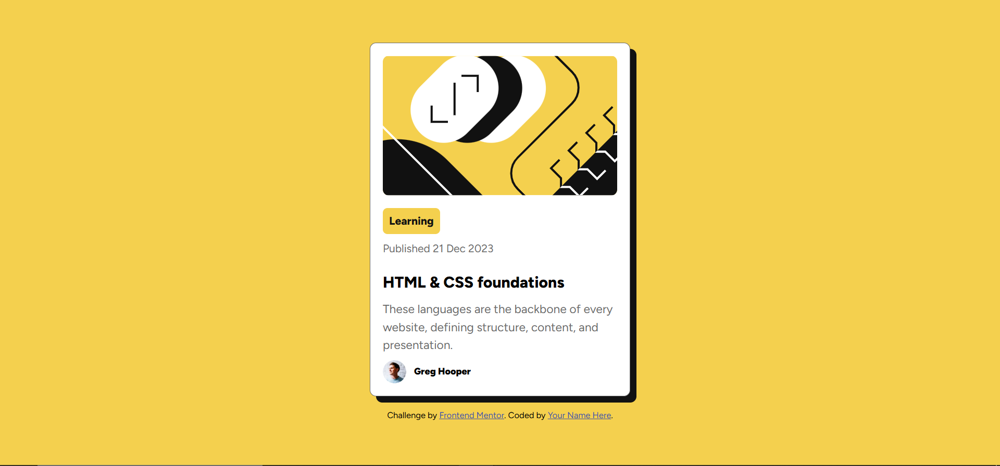

# Frontend Mentor - Blog preview card solution


This is a solution to the [Blog preview card challenge on Frontend Mentor](https://www.frontendmentor.io/challenges/blog-preview-card-ckPaj01IcS). Frontend Mentor challenges help you improve your coding skills by building realistic projects. 

## Table of contents

- [Overview](#overview)
  - [The challenge](#the-challenge)
  - [Screenshot](#screenshot)
  - [Links](#links)
- [My process](#my-process)
  - [Built with](#built-with)
  - [What I learned](#what-i-learned)
  - [Continued development](#continued-development)
  - [Useful resources](#useful-resources)
- [Author](#author)
- [Acknowledgments](#acknowledgments)


## Overview

### The challenge

Users should be able to:

- See hover and focus states for all interactive elements on the page

### Screenshot



### Links

- Solution URL: [Frontend mentor solution page](https://www.frontendmentor.io/solutions/blog-preview-card-sbKklsMrY9)
- Live Site URL: [Live site](https://morrryyyyy.github.io/blog_preview_card/)

## My process

### Built with

- Semantic HTML5 markup
- CSS custom properties
- Flexbox
- CSS Grid
- Mobile-first workflow
- Rem units for better scalability
- Figtree google font
- Hover effects and transitions

### What I learned
This was my first time working with a card layout from scratch and applying semantic HTML with custom properties. I also practiced using rem instead of px, and how to organize my CSS for better readability.
I also learned how to:
- center a container vertically and horizontally using flexbox
- add hover effects for better user interactivity

```css
/* Create variables for colors */
:root {
  --yellow: hsl(47, 88%, 63%);
  --white: hsl(0, 0%, 100%);
  --gray500: hsl(0, 0%, 42%);
  --gray950: hsl(0, 0%, 7%);
}

.container {
  max-width: 18.75rem;
  padding: 1rem;
  border-radius: 0.5rem;
}
```

### Continued development
I’d like to continue improving my understanding of:
  - Responsive design and media queries
  - Accessibility best practices (like using aria labels and better semantics)
  - Organizing CSS more cleanly using a methodology like BEM or utility classes

### Useful resources

- [CSS tricks centering guide](https://css-tricks.com/centering-css-complete-guide/) - This article helped me with centering the container correctly.

## Author

- Frontend Mentor - [@morrryyyyy](https://www.frontendmentor.io/profile/morrryyyyy)


## Acknowledgments

Thanks to Allah for allowing me to keep learning and improving. Also grateful for the supportive coding community online—your tutorials and encouragement go a long way!
